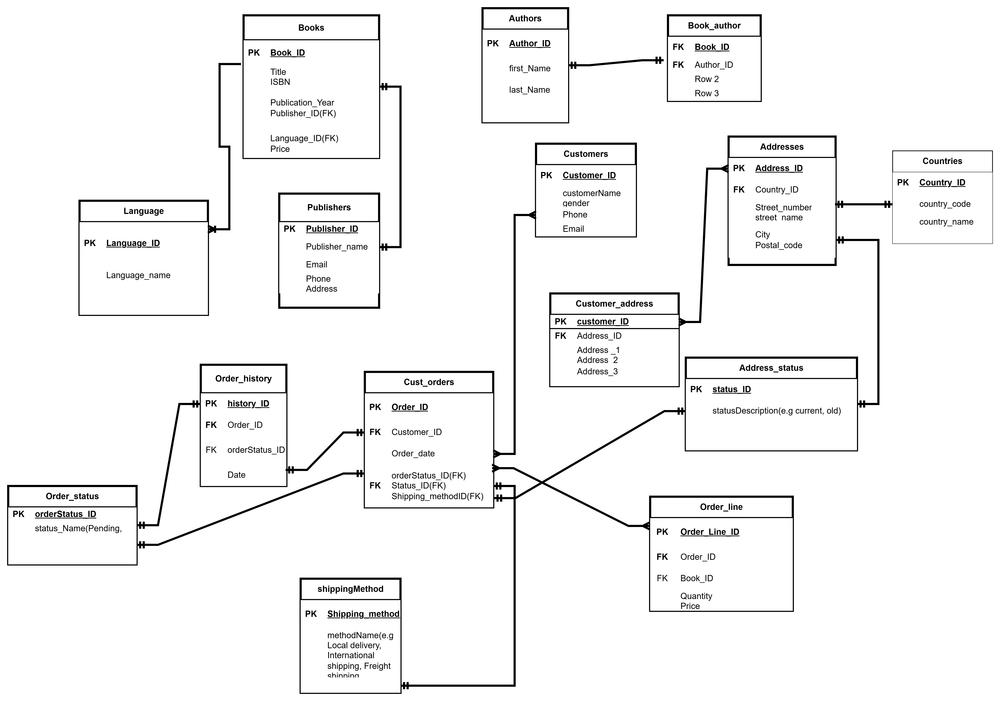

# 📚 Bookstore Database Project

This project sets up a relational database for a bookstore system using MySQL. It includes tables for books, authors, publishers, customers, languages, addresses, and user roles, with role-based access control using MySQL roles.

---

## 🗂️ Database Name
The database is named `bookstore`.

---

## 🛠️ Setup Overview

The SQL script provided with this project:
- Creates the `bookstore` database
- Defines and creates all required tables
- Establishes relationships between entities
- Inserts sample data
- Configures user roles and assigns privileges

---

## 📋 Tables Overview

- **author** – Contains details about each book's author
- **book_language** – Lists all available book languages
- **publisher** – Stores information about publishing companies
- **book** – Contains book-specific details like title, price, language, and publisher
- **book_author** – Resolves many-to-many relationships between books and authors
- **customers** – Holds customer personal data, including name and gender
- **country** – Contains a list of countries used for addresses
- **address** – Maps customer addresses, linking customers and countries

---

## 👥 User Roles & Access Control

This project uses MySQL user roles to manage database access securely. Below are the predefined roles:

### 👩‍💼 SalesStaff
- Has read-only access to the `customers` and `book` tables
- Intended for sales team members who need to view customer and product information

### 📊 DataAnalyst
- Has read-only access to all tables in the database
- Ideal for users who perform data analysis or generate reports

### 🛡️ Admin
- Has full control over all tables and data within the database
- Suitable for database administrators and lead developers

Each role is linked to a specific user account for demonstration purposes.

---

## ✅ Key Features

- Proper relational structure using foreign keys and normalization principles
- Clear separation of access based on user roles
- Ready for expansion with additional features like order tracking, reviews, or inventory management

---

## 🔐 Security Notes

- Roles enforce the principle of least privilege, ensuring each user only accesses what they need
- User roles are used instead of granting direct privileges to enhance security and maintainability
- Replace default sample credentials with secure ones in production environments

---
## 📈ERDIAGRAM

